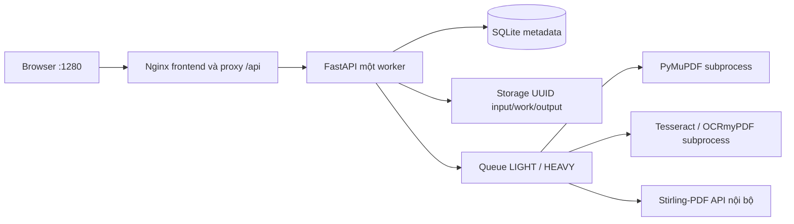

# Kiến trúc OfficeBox

Cập nhật: 2026-09-16. Kiến trúc dưới đây đang chạy local; NAS chưa được nghiệm thu.

Compose chỉ publish frontend tại `127.0.0.1:1280`. Backend cổng 8000 và Stirling cổng 8080 chỉ nằm trong Docker network. Browser gọi cùng origin `/api/v1`; tài liệu không đi qua dịch vụ chuyển đổi bên ngoài.

## Ranh giới module

- `api/routes`: HTTP và schema; không chứa conversion.
- `jobs`: tạo job, trạng thái, queue, recovery, cleanup và download lock.
- `storage`: tên server, path containment, streaming write và safe delete.
- `tools/registry.py`: chín capability, input/options/workload.
- `tools/executor.py`: điều phối tool sang adapter nhỏ.
- `adapters/pymupdf`: PDF/ảnh cục bộ.
- `adapters/ocr`: Tesseract và OCRmyPDF bằng argv, timeout.
- `adapters/stirling`: HTTP streaming tới release đã pin, chuẩn hóa lỗi.

## Dữ liệu và trạng thái

Binary nằm trong `/data/jobs/{uuid}/{input,work,output}`; SQLite chỉ lưu metadata. Luồng trạng thái là `QUEUED → PROCESSING → COMPLETED | FAILED → EXPIRED`. Startup chuyển job PROCESSING cũ thành lỗi an toàn và nạp lại QUEUED hợp lệ. Retention tính từ lúc job kết thúc; cleanup và download phối hợp bằng lock theo job.

Hai semaphore giới hạn LIGHT/HEAVY; mặc định 2/1. Native engine chạy ở subprocess hoặc container nội bộ với timeout. Một ASGI worker và một backend replica bảo toàn mô hình queue SQLite hiện tại.

## API đang dùng

| Endpoint | Hành vi |
|---|---|
| `GET /api/v1/health` | DB, storage và bốn processing service |
| `GET /api/v1/tools` | Metadata/options/availability của chín tool |
| `GET /api/v1/config` | Giới hạn công khai an toàn |
| `POST /api/v1/jobs` | Multipart `tool_id`, `files`, `options`; trả 202 |
| `GET /api/v1/jobs` | Danh sách phân trang |
| `GET /api/v1/jobs/{id}` | Trạng thái và result/error an toàn |
| `DELETE /api/v1/jobs/{id}` | Xóa terminal job; chặn job active |
| `GET /api/v1/jobs/{id}/download` | Attachment có `nosniff`, `no-store` |
| `GET /api/v1/jobs/{id}/preview` | Inline allowlist PDF/ảnh/TXT, same-origin, có expiry/download lock |

## Giới hạn kiến trúc hiện tại

Đây là workspace chung trong môi trường tin cậy, chưa có auth/ownership giữa người dùng. UUID không phải cơ chế phân quyền. Trước khi mở LAN rộng, Internet hoặc NAS nhiều người dùng, phải thêm xác thực, authorization, HTTPS/rate limit phù hợp và chạy lại threat model.
