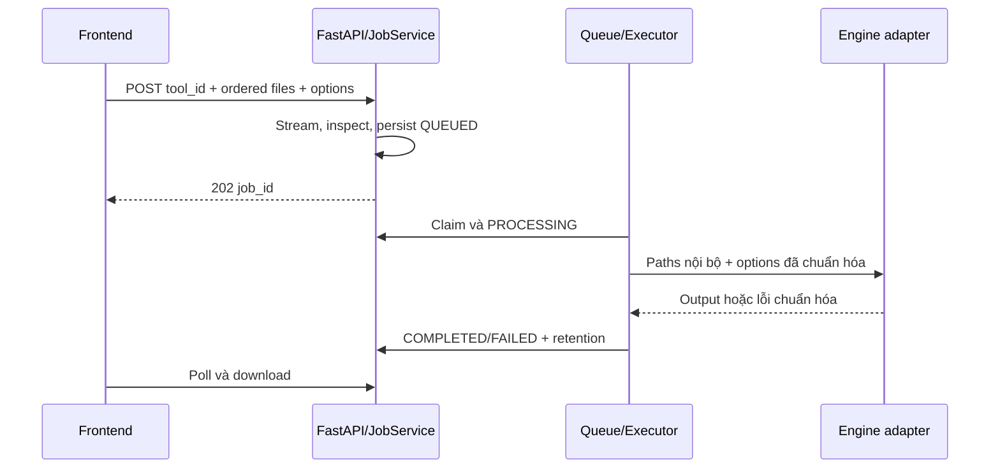

# Kế hoạch frontend và backend OfficeBox

Cập nhật: 2026-09-16. Phần xây dựng chín công cụ đã hoàn tất ở mức code và valid-path local; các mục còn lại tập trung vào nghiệm thu trình duyệt, lỗi/tài nguyên, bảo mật và NAS.

## Phạm vi hiện tại

| Lớp | Đã có | Còn lại |
|---|---|---|
| Frontend | Dashboard, Tools, trang tool dùng chung, multi-file reorder, Jobs, chi tiết/poll/preview/download/delete, Settings | Browser accessibility/responsive/error matrix |
| Backend | Health/config/tools/jobs, SQLite/storage, LIGHT/HEAVY queue, recovery/cleanup, chín executor | Negative/resource/concurrency matrix đầy đủ |
| Engine | PyMuPDF, Tesseract, OCRmyPDF, Stirling nội bộ | Theo dõi CVE và nâng upstream |
| Triển khai | Local Compose cổng 1280, engine không publish | NAS/reverse proxy/auth nếu mở rộng |

## Frontend

Các route đang dùng: `/`, `/tools`, `/tools/:toolId`, `/jobs`, `/jobs/:id`, `/settings`. `ToolPage` dựng form từ registry, `MultiFileDropzone` giữ thứ tự input, API client dùng cùng origin `/api/v1`. UI không biết URL hay credential engine.

Luồng chuẩn:

1. Lấy registry/config.
2. Chọn một hoặc nhiều file theo giới hạn tool, sắp xếp nếu cần.
3. Chọn options từ allowlist và gửi multipart.
4. Chuyển tới chi tiết job, poll đến trạng thái terminal.
5. Download hoặc xóa; job mới luôn tạo từ request mới.

Khi COMPLETED, trang chi tiết xem trực tiếp PDF, PNG/JPEG/WEBP và TXT. ZIP, DOCX, XLSX không nhúng vào trang; UI giải thích và giữ nút tải xuống.

Riêng `/tools/image-to-text`, dropzone lắng nghe paste ảnh PNG/JPEG/WEBP/TIFF khi người dùng không đứng trong control editable. Ảnh clipboard đi qua cùng validation dung lượng/extension như upload. Kết quả TXT được render bằng text node trong `<pre>`, có nút sao chép và không chèn HTML từ OCR.

Điều kiện nghiệm thu còn lại: thử thật bằng trình duyệt trên desktop/mobile, keyboard/focus, mất mạng, lỗi validation, FAILED/EXPIRED, refresh trang chi tiết và download/delete.

## Backend

Adapter boundaries:

- PyMuPDF: render, merge, split, images-to-PDF và inspect.
- OCR: Tesseract TXT và OCRmyPDF searchable PDF bằng argv.
- Stirling: Word, Excel, compress qua HTTP nội bộ; 204 XLSX thành `TABLE_NOT_FOUND`.

Backend không nhận arbitrary path/CLI/URL từ client. Job directory do server cấp; output được kiểm tra trước khi publish.

## Hợp đồng API

| API | Mục đích |
|---|---|
| `GET /api/v1/health` | Readiness an toàn |
| `GET /api/v1/tools` | Registry và option schema |
| `GET /api/v1/config` | Upload/retention limit công khai |
| `POST /api/v1/jobs` | Tạo job multipart |
| `GET /api/v1/jobs[/{id}]` | Danh sách/chi tiết/poll |
| `DELETE /api/v1/jobs/{id}` | Xóa terminal job |
| `GET /api/v1/jobs/{id}/download` | Attachment kết quả |
| `GET /api/v1/jobs/{id}/preview` | Inline preview cho MIME allowlist |

OpenAPI sinh từ FastAPI là nguồn thực thi. TypeScript types phải đồng bộ khi schema đổi.

## Bước còn lại

- [x] FB-01–FB-05: shell, API, upload, conversion, jobs và vòng đời.
- [x] FB-TOOLS: giao diện và backend cho đủ chín công cụ.
- [ ] FB-06a: browser smoke và ma trận local đầy đủ.
- [ ] SEC-LOCAL: xử lý/chấp nhận finding image, negative/resource tests.
- [ ] FB-06b: NAS, quyền volume, reverse proxy, restart và benchmark.

Mỗi bước phải cập nhật STATUS và SESSION_LOG ngay khi có kết quả.
